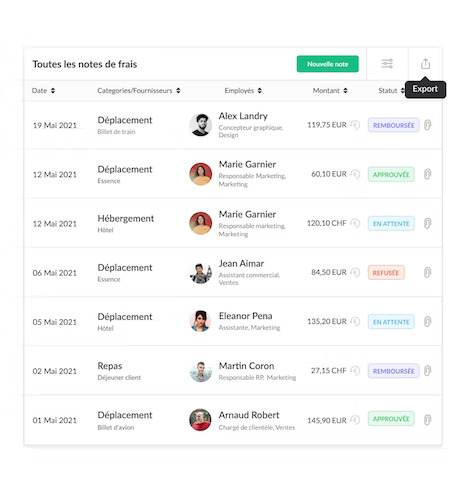
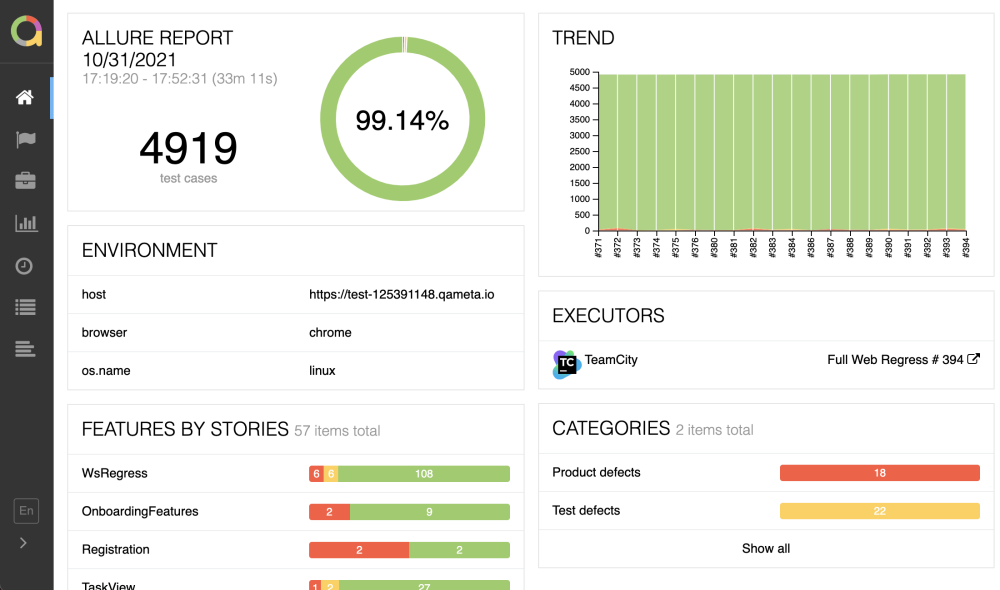

# [Page Objects Model in Selenium](https://selenium-python.readthedocs.io/page-objects.html) with [unittest](https://docs.python.org/3/library/unittest.html?highlight=unit#module-unittest) + [pytest](https://docs.pytest.org/en/stable/contents.html) + [allure](https://qameta.io/allure-report/)  

***by [BelR](https://github.com/belr20) with***
[](https://www.python.org/downloads/release/python-3106/)


Page Objects Model (POM) is a design pattern that you can apply to develop web applications efficient test automation :

* Easy to read test cases
* Creating reusable code that can share across multiple test cases
* Reducing the amount of duplicated code
* If the user interface changes, the fix needs changes in only one place

## Python concept

Basically POM consists of that each page is inherited from a base class which includes basic functionalities for all pages.  
If you have some new functionality that each page has, you can simple add it to the base class.

`BasePage` class includes basic functionality and driver initialization

```python
# base_page.py
class BasePage(object):
    def __init__(self, driver, base_url='https://qsi-conseil.kiwihr.com'):
        self.base_url = base_url
        self.driver = driver
        self.timeout = 30

    def find_element(self, *locator):
        return self.driver.find_element(*locator)
```

`MainPage` is derived from the `BasePage` class, it contains methods related to this page, which will be used to create test steps.

```python
# main_page.py
class MainPage(BasePage):
    def __init__(self, driver):
        self.locator = MainPageLocators
        super().__init__(driver)  # Python3 version

    def check_page_loaded(self):
        return True if self.find_element(*self.locator.LOGO) else False
```

When you want to write tests, you should derive your test class from `BaseTest` which holds basic functionalities for your tests.  
Then you can call pages and related methods in accordance with the steps in the test cases.

```python
@allure.testcase(BASE_URL, 'LogIn page')
@pytest.mark.usefixtures("db_class")
class TestLogInPage(BaseTest):

    @allure.step("LogIn with VALID user")
    def test_login_with_valid_user(self):
        print("\n" + str(formal_test_cases(4)))
        login_page = LogInPage(self.driver)
        result = login_page.login_with_valid_user("valid_user")
        self.assertIn(BASE_URL, result.get_url())
```

## KiwiHR use case

Proposed by [@Abdessalam-Mouttaki](https://github.com/Abdessalam-Mouttaki) from [QSI Conseil](https://qsiconseil.ma/) :pray:  
This use case consists of creating an expense in KiwiHR application :



You can get a free instance for 14 days [here](https://kiwihr.com/fr/inscription).  
Then you have to copy/paste `.env.example` to `.env` & modify the corresponding variables with your :

* KiwiHR instance URL
* KiwiHR username/email
* KiwiHR password

`supplier`, `purchase_date` & `amount` of the expense that will be created are accessible in `tests\test_nouvelle_note_de_frais_page.py`

## Environment

* [ ] First clone this repository (you can get help [here](https://docs.github.com/en/repositories/creating-and-managing-repositories/cloning-a-repository))

```sh
git clone https://github.com/belr20/selenium-page-objects-model-with-unittest.git
cd selenium-page-objects-model-with-unittest
```

* [ ] Then you should create & activate a virtual environment called [venv](https://docs.python.org/3/library/venv.html)

```sh
python -m venv venv
source venv/bin/activate  # On Linux
.\venv\Scripts\activate  # On Windows
```

* [ ] Finally install dependencies

```sh
python -m pip install --upgrade pip wheel setuptools
pip install -r requirements.txt
```

## Running Tests

* [ ] If you want to run all tests with [unittest](https://docs.python.org/3/library/unittest.html?highlight=unit#module-unittest)

```sh
python -m unittest
```

* [ ] If you want to run all tests with [pytest](https://pypi.org/project/pytest/)

```sh
python -m pytest
```

* [ ] If you want to run all tests with [allure](https://pypi.org/project/allure-pytest/) report available in `reports/allure-results` folder

```sh
pytest --alluredir=reports/allure-results
allure serve reports/allure-results
```



:warning: How to install allure CLI [here](https://docs.qameta.io/allure-report/#_installing_a_commandline)

* [ ] If you want to run all tests with HTML report available in `reports` folder

```sh
python tests/base_test.py
```

* [ ] If you want to run just a class

```sh
python -m unittest tests.test_login_page.TestLogInPage
```

* [ ] If you want to run just a test method

```sh
python -m unittest tests.test_login_page.TestLogInPage.test_login_with_valid_user
```

* [ ] Default browser is `chrome`, if you want to run test with `firefox`, prepend CLI with setting `BROWSER` to `'firefox'`

  * On Linux

    ```sh
    BROWSER='firefox' python -m pytest
    ```

  * On Windows CMD

    ```cmd
    set BROWSER = 'firefox'
    python -m pytest
    ```

  * On PowerShell

    ```pwsh
    $Env:BROWSER = 'firefox'
    python -m pytest
    ```

* [ ] Default browser is `chrome`, if you want to run test with `edge`, prepend CLI with setting `BROWSER` to `'edge'`

  * On Linux

    ```sh
    BROWSER='edge' python -m pytest
    ```

  * On Windows CMD

    ```cmd
    set BROWSER = 'edge'
    python -m pytest
    ```

  * On PowerShell

    ```pwsh
    $Env:BROWSER = 'edge'
    python -m pytest
    ```

## Resources

* [Cloning a repository | GitHub](https://docs.github.com/en/repositories/creating-and-managing-repositories/cloning-a-repository)
* [Creation of virtual environments | docs.python.org](https://docs.python.org/3/library/venv.html)

<br/>

* [KiwiHR inscription | kiwihr.com](https://kiwihr.com/fr/inscription)

<br/>

* [Python Decouple | PyPI](https://pypi.org/project/python-decouple/)

<br/>

* [pytest | PyPI](https://pypi.org/project/pytest/)
* [HtmlTestRunner | PyPI](https://pypi.org/project/html-testRunner/)
* [Unit testing framework | docs.python.org](https://docs.python.org/3/library/unittest.html?highlight=unit#module-unittest)
* [How to use unittest-based tests with pytest | docs.pytest.org](https://docs.pytest.org/en/stable/how-to/unittest.html#unittest-testcase)

<br/>

* [Selenium | PyPI](https://pypi.org/project/selenium/)
* [Selenium pytest plugin | PyPI](https://pypi.org/project/pytest-selenium/)
* [Webdriver Manager for Python | PyPI](https://pypi.org/project/webdriver-manager/)
* [Selenium with Python | Page Objects Model | selenium-python.readthedocs.io](https://selenium-python.readthedocs.io/page-objects.html)

<br/>

* [Allure Pytest Plugin | PyPI](https://pypi.org/project/allure-pytest/)
* [Allure Python Integrations | GitHub](https://github.com/allure-framework/allure-python)
* [Allure Framework | CLI install | docs.qameta.io](https://docs.qameta.io/allure-report/#_installing_a_commandline)
